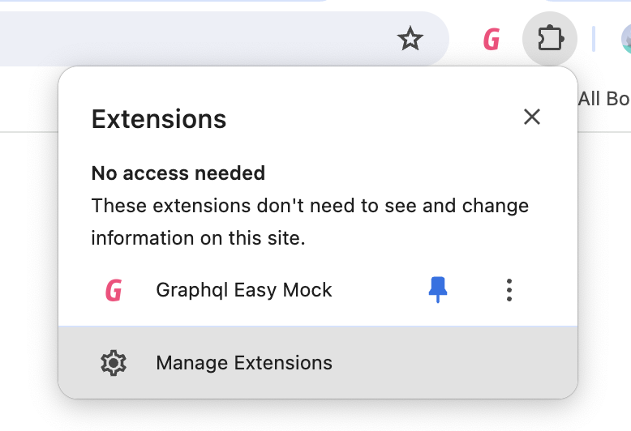
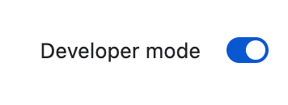
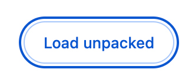
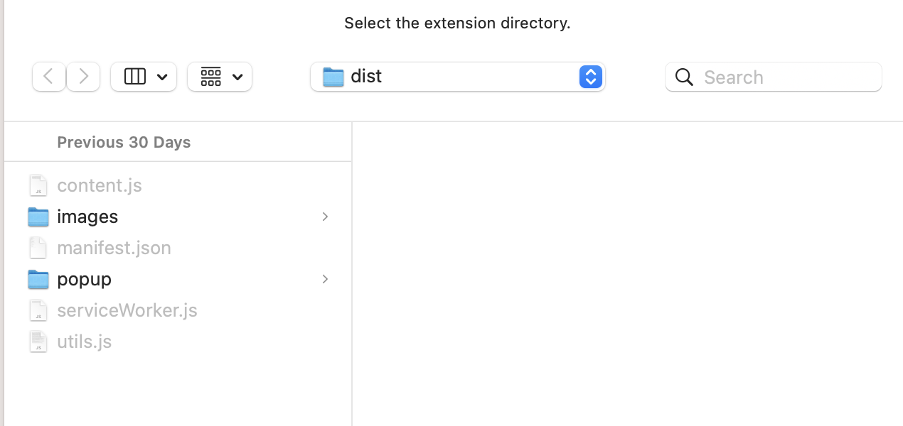
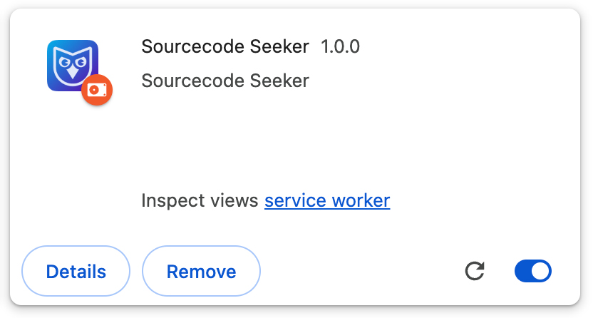
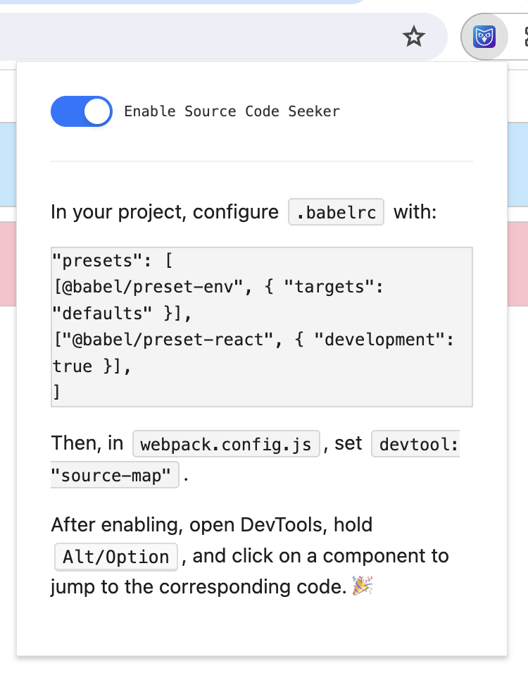
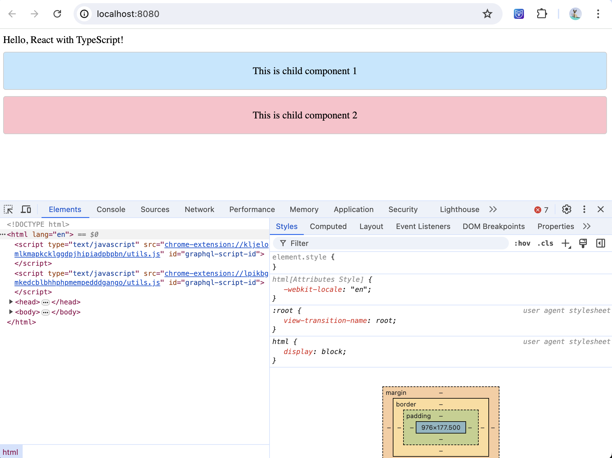
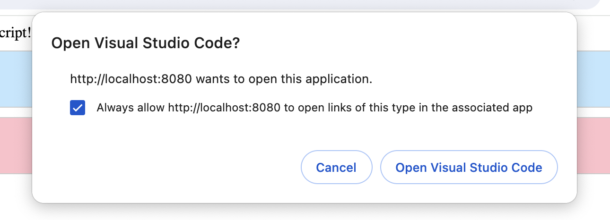
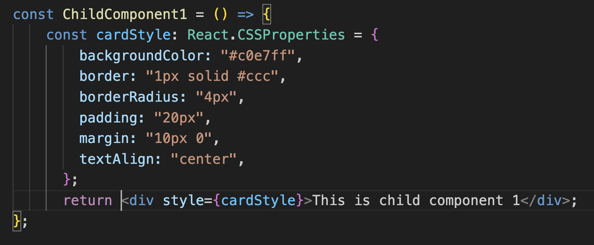

**Code Seek** is a frontend development tool that allows you to locate your component's source code with a single click from the browser. It currently supports React, and support for Vue is under development.

# Installation

The plugin has not been published to the application market yet. You can import the `dist` package from the root directory of this repository into your Chrome extension.

Follow these steps:

1. Click on the Chrome plugin button and then click on "Manage extensions".
   

2. Click "Enable developer mode" in the top right corner.
   

3. Click "Load unpacked".
   

4. Import the `dist` package from the root directory of this repository.
   

5. The plugin has been successfully installed in your Chrome browser.
   

# How to Use

Babel configuration reference: [`.babelrc`](https://github.com/midori-profile/sourcecode-seeker/blob/master/example/react/.babelrc)

This configuration allows you to use the latest JS, JSX, and TS features:
```json
{
  "presets": [
    ["@babel/preset-env", { "targets": "defaults" }],
    ["@babel/preset-react", { "development": true }],
    "@babel/preset-typescript"
  ]
}
```

In your Webpack configuration, the `devtool: "source-map"` option enables Webpack to generate source maps. Refer to this file: [webpack.config.js](https://github.com/midori-profile/sourcecode-seeker/blob/master/example/react/webpack.config.js).

Then, enable the Source Code Seeker:


Open the Inspector (this step is crucial):


Option/Alt-click the component you want to locate:


You will be directed to the source code:


# Exploring

I have provided an example for you to experience the plugin's features:

```sh
cd example/react
pnpm install
pnpm start
```

# Planned Features

1. **Vue Support**: Currently under development and will be added soon.
